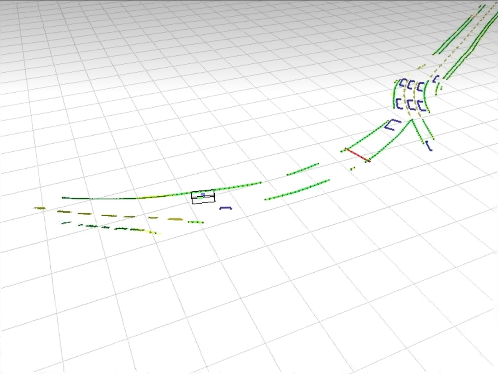

# ICAR

### 视觉



1. 逆透视或者使用[轻量级SLAM](https://www.bilibili.com/video/BV1bp42117N1?vd_source=eac89beacf4b5ecfa9a66e7ebc9bd301)
    事先标定相机与地面的位姿关系得到赛道线在车体坐标系下的坐标
2. 适应赛道反光[双阈值OTSU](https://blog.csdn.net/weixin_55984718/article/details/125769347?spm=1001.2101.3001.6650.3&utm_medium=distribute.pc_relevant.none-task-blog-2%7Edefault%7ECTRLIST%7ERate-3-125769347-blog-19506005.pc_relevant_multi_platform_whitelistv4&depth_1-utm_source=distribute.pc_relevant.none-task-blog-2%7Edefault%7ECTRLIST%7ERate-3-125769347-blog-19506005.pc_relevant_multi_platform_whitelistv4&utm_relevant_index=3)
3. 出弯立刻进圆环，圆环无法识别
4. 帧率锁定
5. 多线程死锁问题，解决意见如下（我的电脑无法编译运行进行测试）：
```c++
// 在子线程中使用类似这样的逻辑，while(ruuning)
{
    cond_.wait(lock, [] { return !messageQueue.empty() || !running; });
    // 检查是否收到终止信号，如果是，则退出循环
    if (!running){
        std::cout << "back ground thread exit" << std::endl;
        break;
    }
}
// main函数中注册信号处理函数，用于捕获 Ctrl+C 信号
std::signal(SIGINT, [](int sig)
            {
                running = false;
                cond_.notify_all(); // 通知后台线程结束等待
                std::cerr << "received signal " << sig << ", shutting down" << std::endl;
            });
```
6. 通过websocket在局域网传输图像，不占用edgeboard图形化资源，可以参考以下链接：
[C++实现foxglove-server](https://github.com/p-xiexin/foxglove_websocket_cpp.git)
[foxglove网页端](https://app.foxglove.dev/)


### 控制

1. 尝试其他控制方法（例如mpc）
2. 使用陀螺仪控制车身
3. 串口延时问题

### 硬件

1. 陀螺仪磁力计(建议购买[成品](https://m.tb.cn/h.gaXLSjIHiuq9kKR?tk=IA7TWqebA6p))
2. 硬件快拆
3. 悬架参数调节(以下是省赛实录)


---

## tools中功能描述
camera_calibrate: 摄像头标定
camera_display: 摄像头查看
cone_blue_enrode: 断路区锥桶形态学处理查看
cone_detection: 停车区传统视觉识别锥桶查验
hsv_blocks: HSV色块识别
image_collection: 图像采集，自行更改存储路径
paddle_detection: 深度学习模型测试
perspective_test: 逆透视查验
uart_test: 串口通信测试、也用于赛前检车车模功能

## 摄像头安装位置
> 摄像头参数：
> 90帧 全局快门
> 摄像头距杆顶部6cm


如果使用卷帘相机，容易出现出弯时无法士别标识物的情况


**摄像头视野：**


## 调车记录

（所有记录都控制了变量唯一）

> 2023/6/21
```json
    "speedLow": 1.5,
    "speedHigh": 1.7,
    "speedAI": 1.0,
    "speedCorners": 1.4,
    "speedcoiled": 1.3,
```

1. 减小**前瞻**到130，车辆在**小连续弯道**出现了明显的晃动；增大前瞻到160，车辆在连续小弯道更加丝滑，切近路。

```json
    "Control_Mid": 160,
    "Control_Skew": 20,
    "Control_Down_set": 140,
    "Control_Up_set": 140,
    "ki_down_out_max": 25,
    "Kp_dowm": 0.0,
    "Ki_down": 0.0,
```

2. 增大**角偏环Kp**到3.4，车辆在**大圆环**的打角更为连续，但是在受到扰动的时候，会使车身的晃动幅度加大；增加`Angle_target`到0.21，即将角偏的目标范围增大，积分的惯性减小，**出弯**抖动明显减小

```json
    "Angle_Kp": 2.4,
    "Angle_Ki": 0.0,
    "dynamic_Mid_low": 150,
    "dynamic_Mid_high": 170,
    "Angle_target": 0.19,
```

3. 减小图像的**底部切行**到10，车辆在**小连续弯道**的转向更加稳定，但是在转**直角弯**的时候更加贴外线，可以考虑跟**线偏环**联合调整。

```json
    "rowCutUp": 40,
    "rowCutBottom": 20,
```

4. 去掉**线偏环Kd**（Kd = 0），车辆的转向更加均匀，但是在**出弯回正**的时候出现了很明显的振动，收敛时间变长。

```json
    "runP1": 1.5,
    "runP2": 0.0264,
    "runP3": 0.00012,
    "runP1_ai": 1.58,
    "runP2_ai": 0.0273,
    "turnP": 3.5,
    "turnD": 5.0,
```
