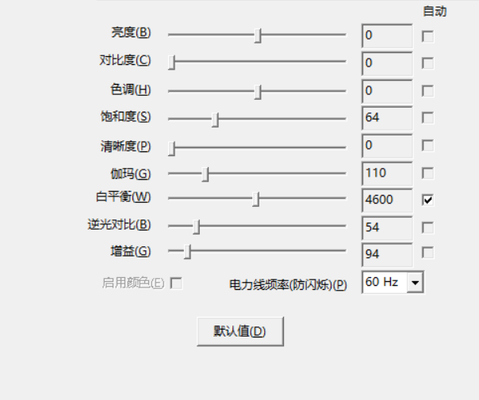
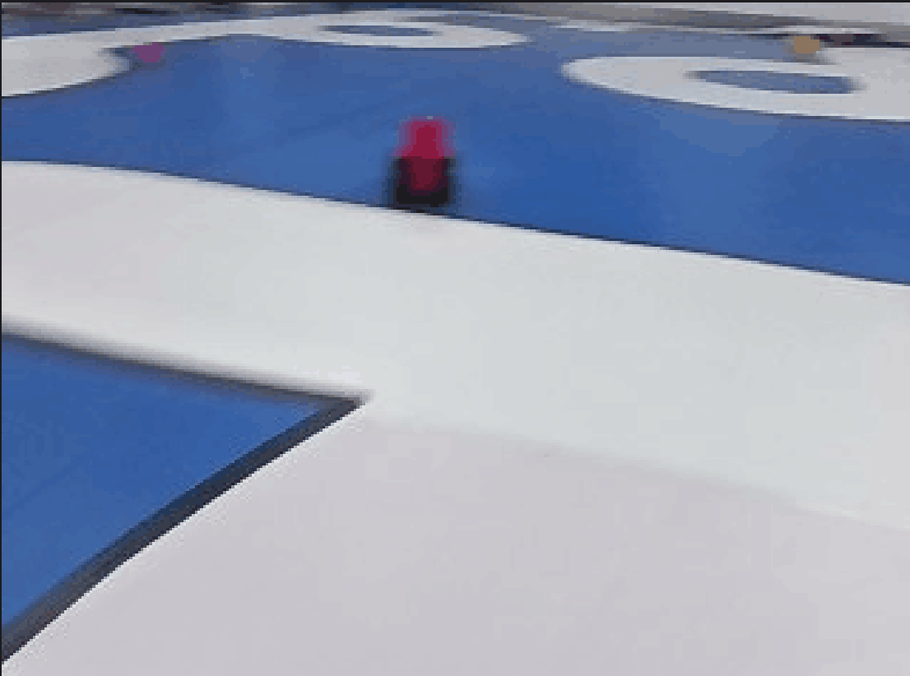
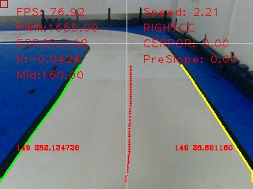
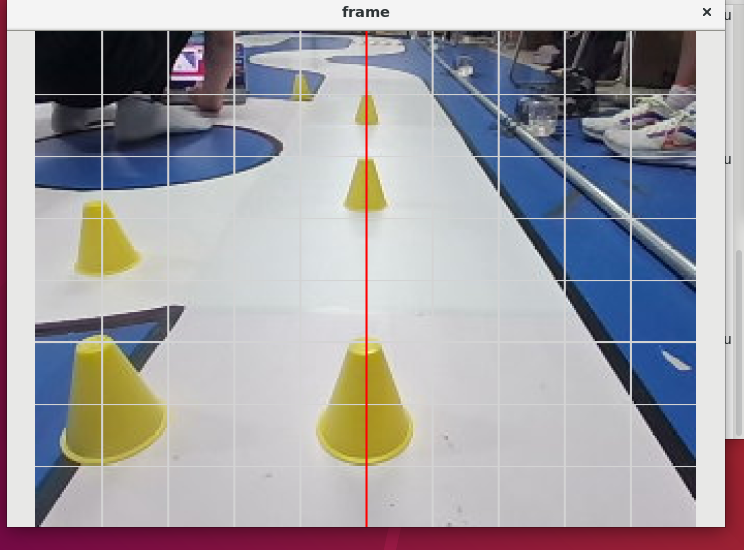
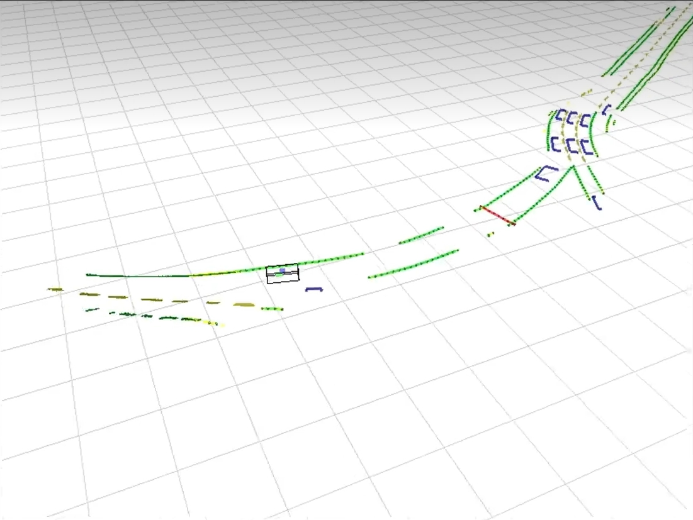

# ICAR

## 1. 赛事成绩

校赛（第二名） → 西部赛区（第一名） → 国赛（第十四名 · 全国一等奖）

## 2. 项目概览

本仓库为武汉理工大学花海队在第十八届智能汽车竞赛完全模型组的 **ICAR 系统记录**，内容包括：

- 调参记录与经验总结
- 当前存在的问题
- 未来的优化方向

⚠️ **注意：文档不包含完整技术方案，只记录经验、问题与展望。**

在传统赛项中，所有图像处理与控制逻辑均在 MCU（下位机）上完成，调参需频繁烧录代码，效率较低。引入边缘计算板卡后，上位机负责图像处理与高层控制，大幅提升了调参与算法迭代效率，而下位机仅保留舵机、电机等底层执行功能，实现了更清晰的任务分层与更高性能的控制体系。

## 3. 视觉部分（Vision）

摄像头安装位置

> 摄像头参数：
> 90帧 全局快门
> 摄像头距杆顶部6cm



如果使用卷帘相机，容易出现出弯时无法士别标识物的情况



**摄像头视野：**





### 3.1 调参经验

> 2023/6/21

```json
    "speedLow": 1.5,
    "speedHigh": 1.7,
    "speedAI": 1.0,
    "speedCorners": 1.4,
    "speedcoiled": 1.3,
```

1. 减小**前瞻**到130，车辆在**小连续弯道**出现了明显的晃动；增大前瞻到160，车辆在连续小弯道更加丝滑，切近路。

```json
    "Control_Mid": 160,
    "Control_Skew": 20,
    "Control_Down_set": 140,
    "Control_Up_set": 140,
    "ki_down_out_max": 25,
    "Kp_dowm": 0.0,
    "Ki_down": 0.0,
```

2. 增大**角偏环Kp**到3.4，车辆在**大圆环**的打角更为连续，但是在受到扰动的时候，会使车身的晃动幅度加大；增加`Angle_target`到0.21，即将角偏的目标范围增大，积分的惯性减小，**出弯**抖动明显减小

```json
    "Angle_Kp": 2.4,
    "Angle_Ki": 0.0,
    "dynamic_Mid_low": 150,
    "dynamic_Mid_high": 170,
    "Angle_target": 0.19,
```

3. 减小图像的**底部切行**到10，车辆在**小连续弯道**的转向更加稳定，但是在转**直角弯**的时候更加贴外线，可以考虑跟**线偏环**联合调整。

```json
    "rowCutUp": 40,
    "rowCutBottom": 20,
```

4. 去掉**线偏环Kd**（Kd = 0），车辆的转向更加均匀，但是在**出弯回正**的时候出现了很明显的振动，收敛时间变长。

```json
    "runP1": 1.5,
    "runP2": 0.0264,
    "runP3": 0.00012,
    "runP1_ai": 1.58,
    "runP2_ai": 0.0273,
    "turnP": 3.5,
    "turnD": 5.0,
```

### 3.2 当前问题（基于原始记录整理）

1. 出弯进入圆环后，圆环特征难以识别。
2. 赛道高反光，需要采用双阈值 OTSU：
   - https://blog.csdn.net/weixin_55984718/article/details/125769347
3. 使用卷帘快门相机时出弯容易运动模糊。
4. 需要帧率锁定。
5. 多线程可能出现死锁，以下为退出方案示例：

```cpp
cond_.wait(lock, [] { return !messageQueue.empty() || !running; });
if (!running) break;

std::signal(SIGINT, [](int sig) {
    running = false;
    cond_.notify_all();
});
```

1. 图像通过 websocket 在局域网传输（不占用 edgeboard 图形资源）：
   - C++ 实现 foxglove-server：https://github.com/p-xiexin/foxglove_websocket_cpp.git
   - foxglove 网页端：https://app.foxglove.dev/

### 3.3 工具（tools/）

| 工具             | 功能             |
| ---------------- | ---------------- |
| camera_calibrate | 摄像头标定       |
| camera_display   | 图像显示         |
| perspective_test | 逆透视测试       |
| hsv_blocks       | HSV 色块识别     |
| cone_detection   | 停车区锥桶识别   |
| cone_blue_enrode | 锥桶形态学去噪   |
| image_collection | 图像采集         |
| paddle_detection | 深度学习检测测试 |
| uart_test        | 串口测试、检车   |

## 4. 硬件部分（Hardware）

### 4.1 当前问题

1. 陀螺仪磁力计易受干扰，建议使用成品模组：
   - https://m.tb.cn/h.gaXLSjIHiuq9kKR?tk=IA7TWqebA6p
2. 硬件结构需支持快拆。
3. 悬架调节对姿态影响明显，存在侧翻风险（原图保留）。

## 5. 未来展望（Roadmap）

### 视觉



1. 逆透视或者使用[轻量级SLAM](https://www.bilibili.com/video/BV1bp42117N1?vd_source=eac89beacf4b5ecfa9a66e7ebc9bd301)
   事先标定相机与地面的位姿关系得到赛道线在车体坐标系下的坐标
2. 适应赛道反光[双阈值OTSU](https://blog.csdn.net/weixin_55984718/article/details/125769347?spm=1001.2101.3001.6650.3&utm_medium=distribute.pc_relevant.none-task-blog-2%7Edefault%7ECTRLIST%7ERate-3-125769347-blog-19506005.pc_relevant_multi_platform_whitelistv4&depth_1-utm_source=distribute.pc_relevant.none-task-blog-2%7Edefault%7ECTRLIST%7ERate-3-125769347-blog-19506005.pc_relevant_multi_platform_whitelistv4&utm_relevant_index=3)
3. 出弯立刻进圆环，圆环无法识别
4. 帧率锁定
5. 多线程死锁问题，解决意见如下：

```c++
// 在子线程中使用类似这样的逻辑，while(ruuning)
{
    cond_.wait(lock, [] { return !messageQueue.empty() || !running; });
    // 检查是否收到终止信号，如果是，则退出循环
    if (!running){
        std::cout << "back ground thread exit" << std::endl;
        break;
    }
}
// main函数中注册信号处理函数，用于捕获 Ctrl+C 信号
std::signal(SIGINT, [](int sig)
            {
                running = false;
                cond_.notify_all(); // 通知后台线程结束等待
                std::cerr << "received signal " << sig << ", shutting down" << std::endl;
            });
```

6. 通过websocket在局域网传输图像，不占用edgeboard图形化资源，可以参考以下链接：
   [C++实现foxglove-server](https://github.com/p-xiexin/foxglove_websocket_cpp.git)
   [foxglove网页端](https://app.foxglove.dev/)


### 控制

1. 尝试其他控制方法（例如mpcc）
   参考论文：[Optimization-Based Autonomous Racing of 1:43 Scale RC Cars](http://arxiv.org/abs/1711.07300)
2. 使用陀螺仪控制车身
3. 串口延时问题

### 硬件

1. 陀螺仪磁力计(建议购买[成品](https://m.tb.cn/h.gaXLSjIHiuq9kKR?tk=IA7TWqebA6p))
2. 硬件快拆
3. 悬架参数调节(以下是省赛实录)
   


## 致谢

完整 MCU 控制由队友维护：
 👉 https://github.com/coollingomg/The-18th-Smart-Car-Competition-complete-model-group

感谢花海队全体成员的努力与支持。


